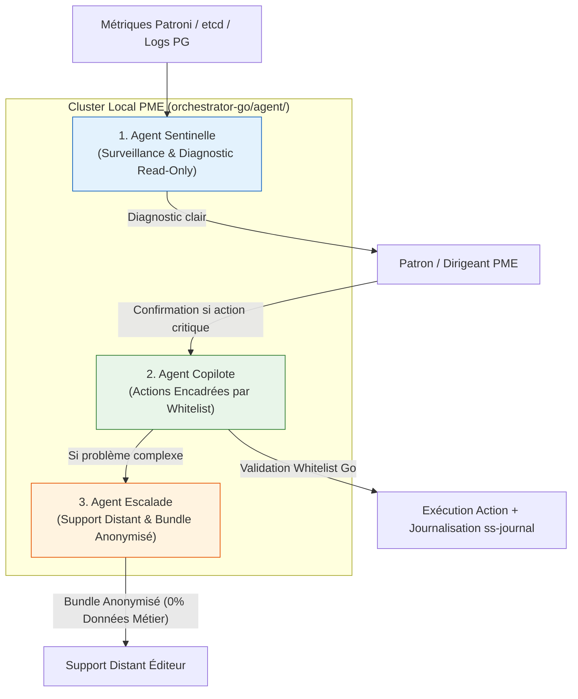

# AMANE — Framework SaaS Souverain
## Spécification d'Architecture : Agents IA d'Exploitation & d'Installation

Ce document est le **guide officiel d'intégration et de référence** pour le déploiement et l'exploitation des **Agents d'Intelligence Artificielle** au sein du Framework AMANE V2. Il définit l'architecture, la matrice de sécurité, les garde-fous déterministes et la structure du code dans le dépôt.

---

## 1. Contexte & Principe Directeur

Les PME ciblées par la solution AMANE ne disposent pas de service informatique dédié pour surveiller leur cluster local. Les agents IA d'exploitation comblent cette absence : ils détectent les anomalies, émettent des diagnostics en langage clair, résolvent les pannes non critiques et accompagnent le dirigeant de la PME.

> 🚨 **RÈGLE D'OR DE SÉCURITÉ DE L'IA**
> **Séparation stricte entre l'automatisation déterministe et l'agent IA.**
> Un modèle de langage (LLM) ne doit **JAMAIS** décider seul d'une action critique d'infrastructure (failover, promotion de nœud, rotation de clé). **Le LLM propose ; le code déterministe valide et exécute.**

| Niveau | Rôle | Mécanisme d'Exécution |
| :--- | :--- | :--- |
| **Automatisation Déterministe** | Failover, promotion de nœud, quorum | Géré par **etcd (Raft) / Patroni** — Règles fixes, prévisibles et sans IA. |
| **Agent IA d'Exploitation** | Diagnostic, communication, actions encadrées | LLM local (Ollama/llama.cpp) + *tool calling* contrôlé par liste blanche fermée. |

---

## 2. Architecture des 3 Agents d'Exploitation Local (Go)

Les 3 agents d'exploitation sont intégrés au binaire Go ([orchestrator-go/agent/](file:///c:/Users/XXX/saas-souverain/orchestrator-go/agent/)) et s'exécutent en local sur les machines PME.



---

### 2.1 Agent Sentinelle — Surveillance et Diagnostic
- **Rôle** : Tourne en continu sur chaque machine du cluster PME. Lit en lecture seule les métriques `Patroni/etcd`, les logs PostgreSQL, l'état du réseau `WireGuard` et la santé gRPC.
- **Sécurité** : **Aucun accès aux clés cryptographiques AK/DEK** (Frontière d'étanchéité mémoire héritée du modèle crypto Rust `core-rust/ss-crypto`).
- **Sortie** : Traduit les logs techniques complexes en diagnostic textuel simple pour l'utilisateur.

### 2.2 Agent Copilote — Actions Encadrées par Liste Blanche
- **Rôle** : Exécute des actions de maintenance uniquement au sein d'une **liste blanche stricte (`whitelist`)** d'actions non destructives codée en Go. Toute action hors liste blanche est rejetée par construction.

```go
// Exemple de validation déterministe dans orchestrator-go/agent/copilot/actions.go
type Action struct {
    Name                 string
    RequiresConfirmation bool
    Execute              func(ctx context.Context, args map[string]any) error
}

var Whitelist = map[string]Action{
    "restart_service":  {RequiresConfirmation: false, Execute: RestartService},
    "clean_wal_logs":   {RequiresConfirmation: false, Execute: CleanWAL},
    "restart_machine":  {RequiresConfirmation: true,  Execute: RestartMachine},
}
```

- **Traçabilité** : Chaque action exécutée est obligatoirement journalisée dans `ss-journal` (append-only CBOR chiffré).

### 2.3 Agent Escalade — Support Distant
- **Rôle** : Intervient lorsque le problème dépasse le périmètre de l'agent Copilote.
- **Anonymisation** : Constitue un **bundle de diagnostic anonymisé** (métriques et logs techniques uniquement — **jamais de données métier ni de clés**).
- **Consentement** : Transmet le bundle au support uniquement après confirmation explicite de l'utilisateur.

---

## 3. Agent IA Assistant d'Installation (Onboarding Web SaaS)

En complément des agents d'exploitation, un **Agent IA Assistant d'Installation** est hébergé sur le portail Web SaaS Éditeur (Django / React) pour accompagner l'utilisateur lors de la création de son compte :

1. **Qualification & Dimensionnement** : Interroge la PME en langage naturel (nb d'employés, OS) et applique la règle : **1 employé = 1 PC = 1 nœud** (explicite le failover automatique pour \(\ge 3\) nœuds).
2. **Pré-requis Techniques** : Vérifie la présence de Docker Desktop et guide son installation en 1 clic sans jargon.
3. **Guidage Nœud Actif** : Génère le package `docker-compose.yml` et valide l'annonce du Nœud 1 (`api_register.py`) avec un signal vert en direct.
4. **Appairage QR Code** : Génère les liens et QR Codes d'invitation à usage unique (`Sealed Box` AK) pour rattacher les PC passifs.
5. **Code de Récupération & Passage de Relais** : Fait imprimer le code de secours souverain (Argon2id) et passe officiellement la main à l'Agent Sentinelle IA.

---

## 4. Arborescence du Code dans le Dépôt

Le code des agents IA d'exploitation est structuré dans le monorepo comme suit :

```
amane/
├── orchestrator-go/
│   └── agent/                     # PERIMETRE AGENTS IA D'EXPLOITATION (Go)
│       ├── sentinel/              # Agent Sentinelle (Surveillance & Diagnostic)
│       │   ├── collector.go       # Collecte des métriques Patroni/etcd/logs (Read-Only)
│       │   └── diagnose.go        # Génération du diagnostic clair par LLM
│       ├── copilot/               # Agent Copilote (Action Encadrée)
│       │   ├── actions.go         # Liste blanche fermée (Whitelist) des actions autorisées
│       │   ├── confirm.go         # Logique de confirmation humaine (Notification / SMS)
│       │   └── executor.go        # Exécution déterministe & journalisation ss-journal
│       ├── escalate/              # Agent Escalade (Support Distant)
│       │   ├── bundle.go          # Génération du bundle anonymisé (0% données métier)
│       │   └── notify.go          # Envoi au support / Ouverture de ticket
│       └── llm/                   # Connecteurs LLM
│           ├── local.go           # Client local Ollama / llama.cpp (Phi / Gemma)
│           └── cloud.go           # Client API distant (Escalade uniquement)
│
├── proto/
│   └── framework.proto            # Remontée du statut d'exploitation (GetClusterStatus)
```

---

## 5. Matrice des Rôles & Niveaux d'Autonomie

| Action d'Exploitation | Agent | Niveau d'Autonomie | Validation Requis |
| :--- | :---: | :---: | :---: |
| **Diagnostic de santé du cluster** | Sentinelle | Automatique | Aucune (Lecture seule) |
| **Redémarrage d'un service planté** | Copilote | Automatique | Whitelist Go |
| **Nettoyage des journaux WAL saturés** | Copilote | Automatique | Whitelist Go |
| **Redémarrage physique d'un serveur** | Copilote | Conditionnel | Confirmation Humaine (App/SMS) |
| **Opérations sur les clés (AK/DEK/Shamir)** | Copilote | ❌ **JAMAIS** | Exécution Humaine Physique Uniquement |
| **Création d'un ticket de support distant** | Escalade | Conditionnel | Accord express du dirigeant PME |

---

## 6. Guide de Validation & Tests des Agents

Avant tout déploiement chez un client PME, les agents IA doivent être validés via 3 harnais de test :

1. **Simulateur de Pannes (Harnais Docker)** : Injection artificielle de pannes (nœud down, disque saturé, latence réseau) dans un cluster `docker-compose` pour vérifier la pertinence du diagnostic Sentinelle.
2. **Tests d'Étanchéité de la Liste Blanche** : Vérification stricte qu'aucune action hors whitelist ne peut s'exécuter, même en cas de réponse malformée ou d'hallucination du modèle LLM.
3. **Mode Dry-Run Obligatoire** : Exécution initiale en mode simulation (l'agent propose les actions sans les exécuter) pour valider le comportement en conditions réelles.
