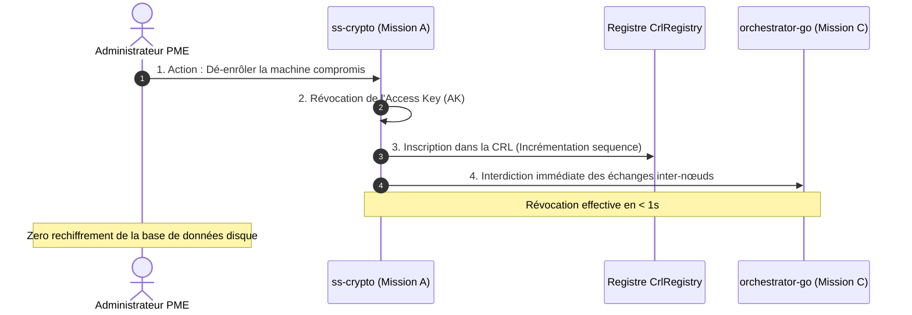
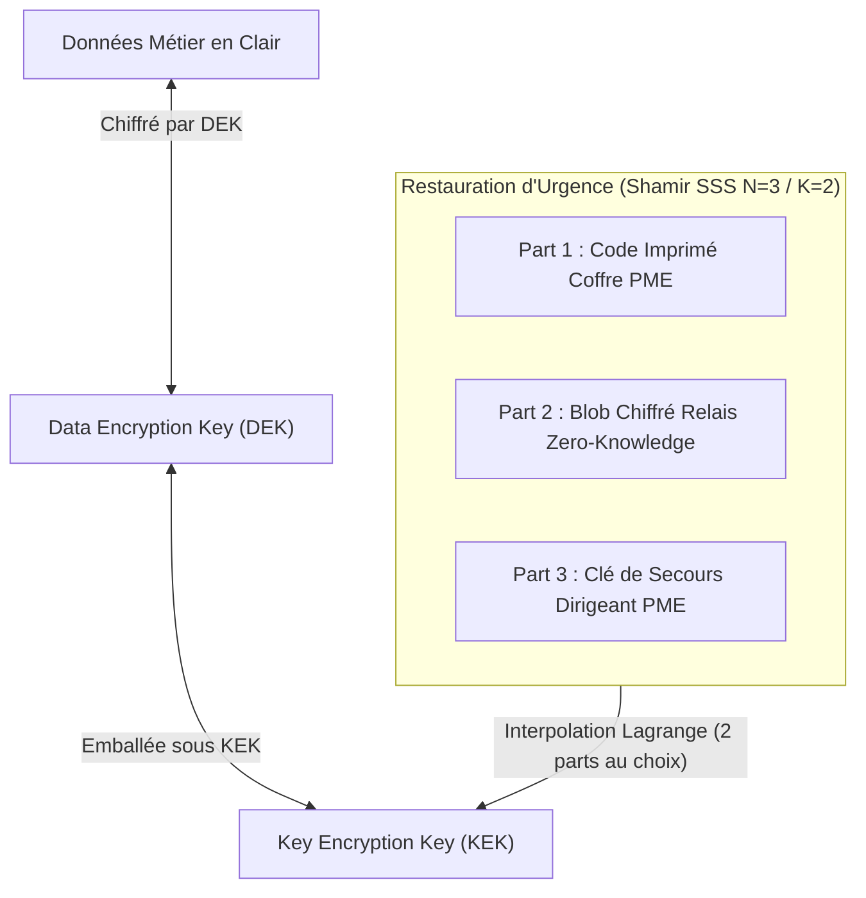

# 🛡️ AMANE V2 — Spécifications & Documentation Cryptographique (Mission A : Crypto)

**Branche Git** : `crypto`  
**Crates concernés** : `spike/crates/ss-crypto` & `spike/crates/ss-journal`  
**Responsable** : Mission A (Cybersécurité & Crypto Souveraineté)  
**Date** : 10 Août 2026

---

## 📌 1. Vue d'Ensemble & Périmètre Réalisé

La **Mission A** constitue le cœur dur de la souveraineté des données du framework **SaaS Souverain Amane V2**. Elle garantit :
- L'étanchéité absolue de la mémoire RAM physique (protection contre les dumps mémoire).
- La séparation stricte entre l'accès au cluster (**AK**) et le chiffrement des données (**DEK**).
- La révocation d'une machine dé-enrôlée en **moins d'une seconde (< 1s)** sans aucun rechiffrement de la base de données.
- La récupération d'urgence Zero-Knowledge de la clé maître par découpage de secret de **Shamir (SSS N=3 / K=2)**.
- L'immuabilité et la confidentialité du **journal d'opérations binaire CBOR**.

---

## 📊 2. Récapitulatif des 5 Étapes d'Ingénierie Réalisées

| Étape | Fichier(s) Cible(s) | Concept Cryptographique | Objectif & Garantie de Sécurité |
| :-: | :--- | :--- | :--- |
| **A1** | [dek.rs](file:///c:/Users/Siradiou/saas-souverain/spike/crates/ss-crypto/src/dek.rs) | **DEK & Sûreté RAM** | Clé symétrique XChaCha20-Poly1305 256 bits avec `ZeroizeOnDrop` (réécriture RAM à 0x00) et masque `fmt::Debug` (`Dek([REDACTED])`). |
| **A2** | [ak.rs](file:///c:/Users/Siradiou/saas-souverain/spike/crates/ss-crypto/src/ak.rs) | **Access Key (AK X25519)** | Biclé d'accès réseau asymétrique séparée de la DEK avec calcul ECDH inter-nœuds, `ZeroizeOnDrop` et masque `fmt::Debug`. |
| **A3** | [crl.rs](file:///c:/Users/Siradiou/saas-souverain/spike/crates/ss-crypto/src/crl.rs) <br/> [error.rs](file:///c:/Users/Siradiou/saas-souverain/spike/crates/ss-crypto/src/error.rs) | **Registre de Révocation CRL** | Invalidation d'AK dé-enrôlée en `< 1s` via HashSet O(1) et numéro de séquence monotone `sequence`, bloquant l'accès sans rechiffrer le disque. |
| **A4** | [shamir.rs](file:///c:/Users/Siradiou/saas-souverain/spike/crates/ss-crypto/src/shamir.rs) | **Hiérarchie KEK & Shamir SSS** | Emballage DEK sous KEK + Découpage de secret de Shamir (seuil K=2 parts sur N=3) sur le corps fini $GF(256)$ pour la restauration sans fuite. |
| **A5** | [entry.rs](file:///c:/Users/Siradiou/saas-souverain/spike/crates/ss-journal/src/entry.rs) <br/> [journal.rs](file:///c:/Users/Siradiou/saas-souverain/spike/crates/ss-journal/src/journal.rs) | **Journal CBOR Append-Only** | Journal immuable binaire `[u32 len ‖ blob_chiffré]`, fonction `count_frames()` par Seek sans déchiffrer, et masquage RAM du payload en Debug. |

---

## 🔍 3. Dépôt & Structure Détaillée des Fichiers

```
spike/crates/
├── ss-crypto/
│   ├── Cargo.toml
│   └── src/
│       ├── lib.rs         # Exports publics des structures et fonctions crypto
│       ├── error.rs       # Enumeration CryptoError (incluant RevokedAccessKey & Shamir)
│       ├── dek.rs         # Structure Dek (XChaCha20-Poly1305 + ZeroizeOnDrop + Debug masqué)
│       ├── ak.rs          # AccessKeyPair & AccessPublicKey (X25519 + ZeroizeOnDrop)
│       ├── crl.rs         # CrlRegistry (Registre de révocation CRL < 1s)
│       ├── shamir.rs      # Kek & ShamirShare (Découpage / Reconstruction K=2/N=3 sur GF(256))
│       ├── device_key.rs  # Enrôlement Sealed Box par QR Code
│       └── recovery.rs    # Dérivation Argon2id par mot de passe maître
└── ss-journal/
    └── src/
        ├── entry.rs       # Structure JournalEntry avec masquage Debug du payload
        ├── error.rs       # Enumeration JournalError
        ├── journal.rs     # Moteur Append-Only CBOR, count_frames() et read_range()
        └── lib.rs         # Exports publics du journal
```

---

## 🔑 4. Détail Technique des Innovations Cryptographiques V2

### 4.1. Séparation AK / DEK & Révocation CRL (< 1s)
* **Problème V1** : Une clé unique (DEK) servait d'accès et de verrou de chiffrement disque. Retirer une machine exigeait de rechiffrer tout le disque PME (minutes à heures de coupure).
* **Solution V2** : 
  * `AccessKeyPair` (AK) gère l'accès au réseau et l'identité.
  * `Dek` gère uniquement le chiffrement du disque.
  * Quand une machine est dé-enrôlée, son `AccessPublicKey` est ajoutée au `CrlRegistry` via `crl.revoke(&ak.public)`. L'accès lui est coupé en **moins d'une seconde**, sans toucher aux données du disque.



---

### 4.2. Hiérarchie KEK & Shamir Secret Sharing (SSS N=3 / K=2)
* **KEK (Key Encryption Key)** : Clé de 256 bits wrappant la DEK via `kek.wrap_dek(&dek)`.
* **Algorithme SSS** : Le secret $\text{KEK}$ est découpé en 3 parts autonomes à l'aide de polynômes sur le corps fini $GF(256)$ ($P(x) = m \cdot x \oplus S$) :
  * **Part 1 (id=1)** : Code imprimé conservé au coffre-fort PME.
  * **Part 2 (id=2)** : Blob chiffré stocké sur le Relais Zero-Knowledge Éditeur.
  * **Part 3 (id=3)** : Clé de secours physique du dirigeant.
* **Reconstruction** : Toute combinaison de **2 parts sur 3** ($(1,2)$, $(1,3)$ ou $(2,3)$) reconstruit la KEK en microsecondes par interpolation de Lagrange à $x=0$ :
  $$S = y_a \cdot \frac{x_b}{x_a \oplus x_b} \oplus y_b \cdot \frac{x_a}{x_a \oplus x_b}$$



---

### 4.3. Journal CBOR Append-Only & Optimisation `count_frames()`
* **Trame binaire sur disque** : `[u32 len_frame (little-endian) ‖ blob_chiffré_CBOR]`
* **Fonction `count_frames()`** : Lit l'en-tête de 4 octets et saute directement les octets du blob avec `reader.seek(SeekFrom::Current(len))`. Permet d'ouvrir le journal et de connaître l'index de départ en microsecondes sans déchiffrer ni allouer de mémoire pour les payloads.
* **Pagination `read_range(start_index, limit)`** : Permet la réplication locale paginée sans surcharge RAM.

---

## 🛡️ 5. Garanties d'Herméticité & Sécurité RAM

1. **Effacement RAM Stricte (`ZeroizeOnDrop`)** :
   * Les types `Dek`, `AccessKeyPair`, `Kek` et `ShamirShare` dérivent tous `Zeroize` et `ZeroizeOnDrop`.
   * Dès qu'une variable sort du scope d'une fonction, Rust écrase physiquement ses octets en mémoire RAM par des zéros (`0x00`), immunisant le système contre les attaques par vidage de mémoire (*cold boot attacks*).
2. **Masquage d'Affichage Debug (`fmt::Debug`)** :
   * `Dek` affiche `Dek([REDACTED])`.
   * `AccessKeyPair` affiche `AccessKeyPair([REDACTED])`.
   * `ShamirShare` affiche `ShamirShare(id: X, data: [REDACTED])`.
   * `JournalEntry` masque son payload sous la forme `<X bytes>`.
   * **Résultat** : Aucune donnée métier ni aucune clé privée ne peut fuiter accidentellement dans les logs système ou les canaux d'erreur.

---

## 🧪 6. Suite de Tests Unitaires Cryptographiques

La totalité des composants développés intègre sa suite de tests unitaires automatisés (`cargo test --package ss-crypto --lib` et `cargo test --package ss-journal --lib`) :
* `test_roundtrip_encryption` : Chiffrement/déchiffrement DEK avec intégrité Poly1305.
* `test_access_keypair_generation` & `test_ecdh_shared_secret` : Génération et accord Diffie-Hellman inter-nœuds X25519.
* `test_crl_revocation_flow` : Révocation instantanée d'AK dans la CRL et vérification $O(1)$.
* `test_kek_wrap_unwrap_dek` : Emballage et déballage de la DEK par la KEK.
* `test_shamir_split_and_reconstruct_all_combinations` : Validation de la reconstruction KEK pour toutes les paires de parts $(1,2)$, $(1,3)$ et $(2,3)$.
* `test_read_range_pagination` & `test_debug_hermeticity` : Pagination du journal et étanchéité de l'affichage Debug.
