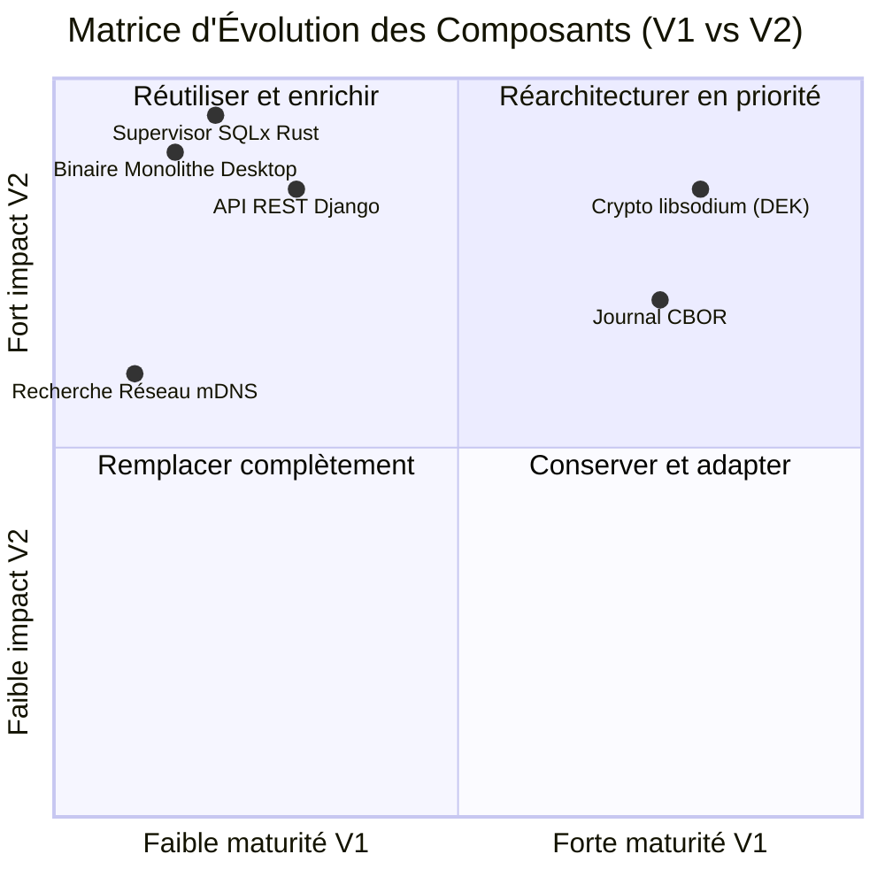

# AMANE — Framework SaaS Souverain
## Guide des Transformations par Mission : Du Code Actuel (V1) à l'Architecture Cible (V2)

Ce document résume **explicitement et en détail** ce que chaque mission (**Mission A**, **Mission B**, **Mission C**) doit modifier et implémenter par rapport au code prototype existant dans `saas-souverain` pour construire l'architecture cible **Amane V2**.

---

## 1. Vue d'Ensemble du Dépôt Unique (Monorepo Cible)

Pour permettre le travail en parallèle sans divergence, le code passe d'un prototype dispersé à un **monorepo unique** structuré par mission et par langage :

```
amane/
├── core-rust/                 # MISSIONS A & B — Crates Rust (Sûreté mémoire & Crypto)
│   ├── ss-crypto/             # Double clé AK/DEK, KEK, Shamir SSS, CRL (Mission A)
│   ├── ss-journal/            # Journal CBOR append-only (Mission A)
│   └── ss-client/             # Logique métier & consommation du SDK gRPC (Mission B)
│
├── orchestrator-go/           # MISSION C — Service Go (Infrastructure & Résilience)
│   ├── consensus/             # etcd (Raft) + Patroni + Fencing (Mission C)
│   ├── replication/           # Réplication CRDT delta multi-site (Mission C)
│   ├── mesh/                  # Réseau maillé WireGuard (Mission C)
│   └── grpcserver/            # Serveur gRPC exposant le framework (Mission C)
│
├── proto/                     # CONTRAT PARTAGÉ (.proto) — Point de contact entre B et C
├── sdk-generated/             # SDKs clients auto-générés (Python/Django, JS/Node.js, etc.)
└── tests/                     # Tests d'intégration automatiques cross-missions (CI)
```

---

## 2. MISSION A : Cybersécurité & Souveraineté Cryptographique
**Langage principal** : Rust (`core-rust/ss-crypto` & `core-rust/ss-journal`)  
**Responsable** : Personne A (Cyber / Crypto)

### 📌 Synthèse des Changements (V1 vs V2)

| Dimension | Code Actuel (`saas-souverain` V1) | Architecture Cible (Amane V2) | Gain & Impact Technique |
| :--- | :--- | :--- | :--- |
| **Modèle de Clés** | Clé unique **DEK** (XChaCha20-Poly1305) pour accès et données. | **Double Clé : AK (Access Key)** + **DEK (Data Encryption Key)**. | Séparation de la clé d'accès (AK) et de la clé de chiffrement des données (DEK). |
| **Dé-enrôlement** | Rotation complète de la DEK ➔ **Rechiffrement lourd de tout le disque** (minutes à heures). | Révocation immédiate de l'AK via **CRL (Certificate Revocation List)**. | Dé-enrôlement en **< 1 seconde**, sans aucun rechiffrement des données. |
| **Récupération Clé** | Dérivation simple par mot de passe maître Argon2id. | **Hiérarchie à 3 couches** : KEK + Argon2id + **Shamir Secret Sharing (SSS N=3/K=2)**. | Récupération instantanée de la KEK (<1s) sans perte de données ni accès éditeur. |
| **Gestion Mémoire** | Effacement de la DEK avec `ZeroizeOnDrop`. | Généralisation de `ZeroizeOnDrop` sur toute la hiérarchie AK / DEK / KEK + Audit d'herméticité. | Garantie stricte qu'aucune clé ne fuit en RAM, dans les logs ou vers le code Go. |

### 🛠️ Ce que la Mission A doit écrire/modifier dans le code :
1. **Implémenter la séparation AK / DEK** :
   - Refondre `ss-crypto/src/dek.rs` pour restreindre la DEK au chiffrement des blobs de données.
   - Créer le module `ss-crypto/src/ak.rs` gérant les paires de clés `X25519` d'accès et les tokens signés `Ed25519`.
2. **Développer le gestionnaire de CRL** :
   - Créer `ss-crypto/src/crl.rs` pour enregistrer la liste de révocation des clés d'accès. Invalidation en quelques millisecondes lors du dé-enrôlement (Interface 1).
3. **Mettre en place la hiérarchie KEK & Shamir SSS** :
   - Implémenter la dérivation de l'enveloppe **KEK (Key Encryption Key)**.
   - Implémenter l'algorithme de partage de secret de Shamir **SSS (Seuil K=2 sur N=3 parts)** pour parer à la perte de mot de passe.
4. **Garantir l'herméticité (Frontière A ↔ B)** :
   - S'assurer qu'aucune opération de `ss-crypto` ou `ss-journal` ne transmet de données en clair vers le composant Go ou vers l'extérieur.

---

## 3. MISSION B : Développement & Intégration Logicielle
**Langage principal** : Rust (`core-rust/ss-client`) + Client du SDK gRPC généré  
**Responsable** : Personne B (Dev & Logique Métier)

### 📌 Synthèse des Changements (V1 vs V2)

| Dimension | Code Actuel (`saas-souverain` V1) | Architecture Cible (Amane V2) | Gain & Impact Technique |
| :--- | :--- | :--- | :--- |
| **Unité & Mode de Distribution** | Application Desktop monolithe / Binaire natif par OS lié au code web. | **SDK Framework distribuable** via gRPC, consommé par n'importe quel éditeur SaaS (Python, JS...). | Découplage total : l'éditeur SaaS installe le SDK (`pip install` / `npm install`) sans connaître Rust/Go. |
| **Contrat d'Interface** | Requêtes HTTP REST directes / API Django. | Contrat unique **Protocol Buffers (`.proto`)** avec SDKs clients auto-générés. | Une seule définition `.proto` régit tous les langages clients sans risque de divergence. |
| **Mode Hors-Ligne** | Réplication synchrone bloquante. | **Lecture Hors-Ligne Autonome (Offline Read)** + Dégradation gracieuse. | Consultation des données en local même si le réseau ou les répliques sont coupés. |
| **Vérification Licence** | Vérification en ligne directe au démarrage. | **Jetons de licence cryptographiques autonomes (Blind Relay)** signés. | Validation autonome de licence sans dépendre du serveur SaaS central en permanence. |

### 🛠️ Ce que la Mission B doit écrire/modifier dans le code :
1. **Passer du prototype monolithic au SDK gRPC généré** :
   - Abandonner la dépendance directe aux modèles web Django/React dans le binaire client.
   - Consommer les SDKs auto-générés dans `sdk-generated/` pour toutes les opérations (enrôlement, lecture, écriture).
2. **Consommer le contrat `.proto` partagé** :
   - Définir avec la Mission C les méthodes RPC dans `proto/framework.proto` (chemin d'écriture B ↔ C, lecture, appairage).
3. **Encapsuler les invariants métier & le mode hors-ligne** :
   - Implémenter dans `ss-client` la gestion des invariants (numérotation continue des pièces, cohérence de stock).
   - Assurer la dégradation gracieuse en mode lecture seule si le quorum ou le réseau est indisponible.
4. **Appairage par QR Code V2** :
   - Adapter l'appairage par QR Code pour sceller l'**AK** (et non la DEK directement), en conformité avec la hiérarchie de la Mission A.

---

## 4. MISSION C : System Design & Résilience Cluster Distribué
**Langage principal** : Go (`orchestrator-go/`)  
**Responsable** : Personne C (System Design & Infra)

### 📌 Synthèse des Changements (V1 vs V2)

| Dimension | Code Actuel (`saas-souverain` V1) | Architecture Cible (Amane V2) | Gain & Impact Technique |
| :--- | :--- | :--- | :--- |
| **Consensus & Failover** | Supervisor SQLx "fait maison" en Rust (interroge Postgres). Failover en 15-30s. | **etcd (Raft local) + Agent Patroni** en Go. Failover automatique en **< 3 à 5s**. | Suppression du risque de *split-brain* grâce à l'isolation stricte (*lease-based fencing*). |
| **Réseau Inter-Site** | Requêtes HTTP brutes au relais cloud. | Réseau maillé **WireGuard Mesh (`10.10.A.0/24`)** avec traversée NAT. | Connexions sécurisées et chiffrées (TLS 1.3 + DEK) uniquement en sortant (DNSSEC). |
| **Gestion des Conflits** | Aucune (verrous bloquants inter-sites sur écritures). | Réplication **CRDT (delta)** pour le stock + CAP Hybride. | Ventes multi-sites simultanées **non-bloquantes** avec convergence automatique. |
| **Contrôle WAL Postgres** | Risque d'accumulation de 200 GB de WAL orphelins. | Paramétrage strict `synchronous_commit = on` et `max_slot_wal_keep_size`. | Borne stricte de l'empreinte disque et contrôle du WAL bloat. |
| **Exposition Framework** | Serveur web Django / REST. | **Serveur gRPC natif en Go** (`grpcserver/`). | Interface réseau unique, haute performance pour exposer le framework aux SDKs. |

### 🛠️ Ce que la Mission C doit écrire/modifier dans le code :
1. **Remplacer le supervisor SQLx Rust par etcd + Patroni** :
   - Supprimer l'ancien supervisor Rust (`spike/crates/ss-consensus/src/supervision.rs`).
   - Implémenter le service Go `orchestrator-go/consensus/` intégrant le client officiel `etcd` et l'agent `Patroni`.
2. **Construire le serveur gRPC exposant le framework** :
   - Écrire `orchestrator-go/grpcserver/` pour exécuter le serveur gRPC d'après les spécifications de `proto/`.
3. **Déployer le réseau maillé WireGuard Mesh** :
   - Implémenter `orchestrator-go/mesh/` pour orchestrer les tunnels WireGuard entre nœuds et sites distants.
4. **Mettre en place la réplication CRDT multi-site** :
   - Écrire `orchestrator-go/replication/` pour gérer la synchronisation delta des données tolérantes aux conflits (ex: états de stock).

---

## 5. Les 3 Contrats d'Interface Obligatoires entre Missions

Pour que les 3 missions travaillent en parallèle sans se bloquer, **trois contrats d'interface stricts** sont établis :

```mermaid
flowchart LR
    subgraph Mission A [Mission A : Rust Crypto]
        AK["Double Clé AK/DEK"]
        CRL["Gestion CRL"]
        JRN["Journal CBOR"]
    end

    subgraph Mission B [Mission B : Rust/Client Dev]
        INV["Invariants Métier"]
        SDK["SDK gRPC Client"]
    end

    subgraph Mission C [Mission C : Go Orchestrator]
        ETCD["etcd + Patroni"]
        WG["WireGuard Mesh"]
        GRPC["Serveur gRPC"]
    end

    Mission A <-->|"Interface 1 : Enrôlement & Membership<br>(Dé-enrôlement A ➔ Recalcul Quorum C)"| Mission C
    Mission A <-->|"Interface 2 : Frontière Chiffrement<br>(Aucun clair vers B ou C)"| Mission B
    Mission B <-->|"Interface 3 : Chemin d'Écriture<br>(Opération B ➔ Journal ➔ Réplication C)"| Mission C

    style Mission A fill:#ffebee,stroke:#c62828
    style Mission B fill:#e8f5e9,stroke:#2e7d32
    style Mission C fill:#e3f2fd,stroke:#1565c0
```

1. **Interface 1 (Mission A ↔ Mission C) — Enrôlement & Membership** :
   - *Règle* : Posséder une clé (A) = appartenir au cluster (C). Lorsqu'une machine est dé-enrôlée par A (révocation AK dans la CRL), A notifie C qui déclenche immédiatement le recalcul du quorum.
2. **Interface 2 (Mission A ↔ Mission B) — Frontière de Chiffrement** :
   - *Règle* : Tout ce qui sort du client B vers le relais ou le serveur C doit être chiffré par A. Aucun texte clair ne doit être visible ou accessible par l'orchestrateur Go.
3. **Interface 3 (Mission B ↔ Mission C) — Chemin d'Écriture** :
   - *Règle* : Flux de validation d'écriture : `Opération (B) ➔ Validation Invariants (B) ➔ Écriture Journal (A/B) ➔ Réplication Synchrone (C) ➔ Confirmation à l'application (B via gRPC)`.

---

## 6. Synthèse Comparative Complète (Tableau Récapitulatif)



| Composant | Code Actuel (`saas-souverain` V1) | Architecture Cible (Amane V2) | Mission Responsable |
| :--- | :--- | :--- | :---: |
| **Gestion Clés** | Clé DEK unique | Double clé **AK / DEK + CRL + KEK + Shamir SSS** | **Mission A** |
| **Journal** | CBOR append-only local | CBOR append-only chiffré intégré au SDK | **Mission A** |
| **Consensus** | Supervisor SQLx custom | **etcd (Raft) + Patroni (Failover < 5s)** | **Mission C** |
| **Réseau Inter-Site** | HTTP brut au relais | **WireGuard Mesh (`10.10.A.0/24`)** | **Mission C** |
| **Distribution** | Binaire natif / App Desktop | **Serveur gRPC (Go) + SDKs générés (.proto)** | **Missions B & C** |
| **Conflits Stock** | Verrous bloquants | **CRDT (delta) pour vente multi-site** | **Mission C** |
| **Intégration CI** | Scripts de test manuels | **Pipeline CI monorepo (build-rust, build-go, proto-check)** | **Toutes** |
